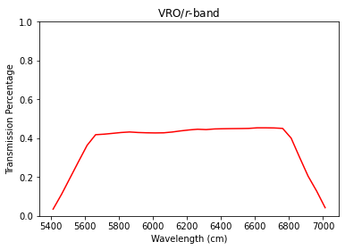
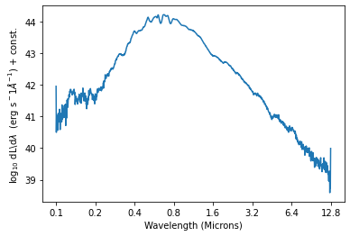
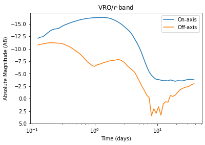
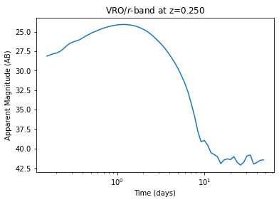

# cocteau
Author: Eve Chase

Astronomical tools for reading and manipulatng lightcurves, spectra, and bandpass filter functions.


## Example use cases


```python
from astropy import units
from astropy.cosmology import Planck18_arXiv_v2
from cocteau import filereaders, observations
from cocteau import observational_utils as utils
import numpy as np


```

## Read and plot a band
Use the VRO r-band as an example


```python
# Initiate FileReader object
fr = filereaders.FileReader()

# Store band filename
band_filename = 'example/r_VRO.dat'

# Assign a string name to the band
bandname = 'r-band'

# Read in the band, noting the units
band = fr.read_band(band_filename, bandname, 
    wl_units=units.Angstrom)

# Plot the band
ax = band.plot(color='r')
ax.set_title(r'VRO/$r$-band')

# Compute the effective wavelength for the band
wl_eff = band.effective_wavelength()
print(f'Effective wavelength: {wl_eff:.2f}')
```

    Effective wavelength: 6220.05 Angstrom


    

    


## Read in a spectrum
For this example, we'll read in a simulated spectrum from the LANL grid of kilonova simulations (Wollaeger et al. 2021- https://zenodo.org/record/5745556).

Note that each `*.dat` file in the LANL grid contains 54 spectra for the same system, each rendered at a different viewing angle.


```python
# Set the filename
spectra_filename = 'example/Run_TS_dyn_all_lanth_wind1_all_md0.001_vd0.3_mw0.1_vw0.05_spec_2020-03-10.dat'

# Initiate a LANL filereader object
fr = filereaders.LANLFileReader()

# Timestep to read spectrum for (must exactly match time in file)
timestep = 2.0 * units.day

# Angle to plot (integer between 0 and 53 for LANL data)
angle = 0

# Read in the spectrum object
spectrum = fr.read_spectrum(spectra_filename, timestep=timestep,
    angle=angle, remove_zero=True)

# Print some parameters of the spectrum
print('Wavelengths:', spectrum.wavelength_arr[:10])
print('Flux density:', spectrum.flux_density_arr[:10])

# Plot the spectrum - need to remove_zero to plot
spectrum.plot()
```

    Wavelengths: [1.00235e-05 1.00710e-05 1.01190e-05 1.01670e-05 1.02155e-05 1.02640e-05
     1.03125e-05 1.03615e-05 1.04110e-05 1.04605e-05] cm
    Flux density: [74.5977   2.62835  9.16651  6.08914  7.86527  3.21554  3.0699   4.3488
     10.4172   5.56802] Ba / s


    <AxesSubplot:xlabel='Wavelength (Microns)', ylabel='$\\log_{10}$ dL\\d$\\lambda$  (erg s$^-1 \\AA^{-1}$) + const. '>


    

    


## Read multiple spectra at the same time
Often it's useful to extract all timesteps simultaneously


```python
# Get full spectra object for one angle
spectra = fr.read_spectra(spectra_filename, angles=[0],
    remove_zero=True)
print(spectra)
```

    {0: <cocteau.observations.SpectraOverTime object at 0x7ff400696b00>}


```python
# Print properties of spectra
spectra[0].timesteps
```


$[0.125,~0.136,~0.149,~0.162,~0.177,~0.193,~0.21,~0.229,~0.25,~0.273,~0.297,~0.324,~0.354,~0.386,~0.42,~0.459,~0.5,~0.545,~0.595,~0.648,~0.707,~0.771,~0.841,~0.917,~1,~1.091,~1.189,~1.297,~1.414,~1.542,~1.682,~1.834,~2,~2.181,~2.378,~2.594,~2.828,~3.084,~3.364,~3.668,~4,~4.362,~4.757,~5.187,~5.657,~6.169,~6.727,~7.336,~8,~8.724,~9.514,~10.375,~11.314,~12.338,~13.454,~14.672,~16,~17.448,~19.027,~20.749,~22.627,~24.675,~26.909,~29.344,~32,~34.896,~38.055] \; \mathrm{d}$


```python
# Plot Spectrum at time=2 days
time_idx = np.where(spectra[0].timesteps.value == 2)[0][0]
print(time_idx)

spectra[0].spectra[time_idx].plot()
```

    32


    <AxesSubplot:xlabel='Wavelength (Microns)', ylabel='$\\log_{10}$ dL\\d$\\lambda$  (erg s$^-1 \\AA^{-1}$) + const. '>


    

    


## Read spectra at all 54 viewing angles 


```python
# Create spectra objects for all 54 viewing angles
spectra = fr.read_spectra(spectra_filename, 
    angles=np.arange(54), remove_zero=True)
print(spectra)
```

    {0: <cocteau.observations.SpectraOverTime object at 0x7ff406186978>, 1: <cocteau.observations.SpectraOverTime object at 0x7ff406186a90>, 2: <cocteau.observations.SpectraOverTime object at 0x7ff403a6f278>, 3: <cocteau.observations.SpectraOverTime object at 0x7ff403a6f978>, 4: <cocteau.observations.SpectraOverTime object at 0x7ff40619b320>, 5: <cocteau.observations.SpectraOverTime object at 0x7ff40619b550>, 6: <cocteau.observations.SpectraOverTime object at 0x7ff40619b9b0>, 7: <cocteau.observations.SpectraOverTime object at 0x7ff4074b6da0>, 8: <cocteau.observations.SpectraOverTime object at 0x7ff4074adc88>, 9: <cocteau.observations.SpectraOverTime object at 0x7ff4074ad6d8>, 10: <cocteau.observations.SpectraOverTime object at 0x7ff407490a90>, 11: <cocteau.observations.SpectraOverTime object at 0x7ff407490978>, 12: <cocteau.observations.SpectraOverTime object at 0x7ff407498c18>, 13: <cocteau.observations.SpectraOverTime object at 0x7ff407498cf8>, 14: <cocteau.observations.SpectraOverTime object at 0x7ff4006ed6a0>, 15: <cocteau.observations.SpectraOverTime object at 0x7ff4006ed668>, 16: <cocteau.observations.SpectraOverTime object at 0x7ff4006ed5f8>, 17: <cocteau.observations.SpectraOverTime object at 0x7ff4006ed470>, 18: <cocteau.observations.SpectraOverTime object at 0x7ff4006ed550>, 19: <cocteau.observations.SpectraOverTime object at 0x7ff40065b9e8>, 20: <cocteau.observations.SpectraOverTime object at 0x7ff40065b940>, 21: <cocteau.observations.SpectraOverTime object at 0x7ff40065b908>, 22: <cocteau.observations.SpectraOverTime object at 0x7ff40065b9b0>, 23: <cocteau.observations.SpectraOverTime object at 0x7ff40065b828>, 24: <cocteau.observations.SpectraOverTime object at 0x7ff40065b898>, 25: <cocteau.observations.SpectraOverTime object at 0x7ff4074beeb8>, 26: <cocteau.observations.SpectraOverTime object at 0x7ff4074bee80>, 27: <cocteau.observations.SpectraOverTime object at 0x7ff4074c7f98>, 28: <cocteau.observations.SpectraOverTime object at 0x7ff4074c7c88>, 29: <cocteau.observations.SpectraOverTime object at 0x7ff4074c7d68>, 30: <cocteau.observations.SpectraOverTime object at 0x7ff4074c7ba8>, 31: <cocteau.observations.SpectraOverTime object at 0x7ff4074c7d30>, 32: <cocteau.observations.SpectraOverTime object at 0x7ff40071b710>, 33: <cocteau.observations.SpectraOverTime object at 0x7ff40071bf60>, 34: <cocteau.observations.SpectraOverTime object at 0x7ff40071bbe0>, 35: <cocteau.observations.SpectraOverTime object at 0x7ff40071beb8>, 36: <cocteau.observations.SpectraOverTime object at 0x7ff40071b6a0>, 37: <cocteau.observations.SpectraOverTime object at 0x7ff40071bb38>, 38: <cocteau.observations.SpectraOverTime object at 0x7ff40071ba20>, 39: <cocteau.observations.SpectraOverTime object at 0x7ff400713c18>, 40: <cocteau.observations.SpectraOverTime object at 0x7ff400713c88>, 41: <cocteau.observations.SpectraOverTime object at 0x7ff400713470>, 42: <cocteau.observations.SpectraOverTime object at 0x7ff400713cf8>, 43: <cocteau.observations.SpectraOverTime object at 0x7ff400713dd8>, 44: <cocteau.observations.SpectraOverTime object at 0x7ff4074a6a20>, 45: <cocteau.observations.SpectraOverTime object at 0x7ff4074a6be0>, 46: <cocteau.observations.SpectraOverTime object at 0x7ff4074a6b38>, 47: <cocteau.observations.SpectraOverTime object at 0x7ff4074a6ba8>, 48: <cocteau.observations.SpectraOverTime object at 0x7ff4074a6a90>, 49: <cocteau.observations.SpectraOverTime object at 0x7ff4074a6b00>, 50: <cocteau.observations.SpectraOverTime object at 0x7ff400727dd8>, 51: <cocteau.observations.SpectraOverTime object at 0x7ff400727c18>, 52: <cocteau.observations.SpectraOverTime object at 0x7ff400727cf8>, 53: <cocteau.observations.SpectraOverTime object at 0x7ff400727da0>}


```python
# Compare two viewing angles, both at t=2 days
ax = spectra[0].spectra[time_idx].plot(label='Face-on')
ax = spectra[27].spectra[time_idx].plot(ax=ax, label='Edge-on')
ax.legend()
```


    <matplotlib.legend.Legend at 0x7ff406efac18>


    

    


## Compute a magnitude
Using a spectrum and a band, compute a magnitude


```python
# Compute absolute magnitude
abs_mag = observations.compute_magnitude_at_timestep(spectrum, band,
    num_angles=54).value
print(f'Absolute mag: {abs_mag:.2f}')

# Convert to apparent magnitude at 100 Mpc
dist_lum = 100 * units.Mpc
app_mag = utils.appMag(abs_mag, dist_lum)
print(f'Apparent mag: {app_mag:.2f}')
```

    Absolute mag: -15.84
    Apparent mag: 19.16


## Compute a lightcurve
Using a set of time-dependent spectra and a band, compute a lightcurve. Do this for both face-on and edge-on viewing angles


```python
for angle in [0, 27]:

    # Select spectra to use
    spectra_to_compute = spectra[angle]

    # Create a lightcurve object
    lc = observations.LightCurve(times=spectra_to_compute.timesteps,
        spectra=spectra_to_compute, band=band)
    
    # Plot the lightcurve
    if angle == 0:
        ax = lc.plot(label='On-axis')
    elif angle == 27:
        ax = lc.plot(ax=ax, label='Off-axis')
        
ax.legend()
ax.set_title(r'VRO/$r$-band')
ax.set_ylim(5, None)
```


    (5.0, -17.28300115652786)


    

    


## Compute lightcurves at different redshifts
This redshifts the rest-frame spectra


```python
# Set redshift
redshift = 0.25

# Compute corresponding luminosity distance
dist_lum = Planck18_arXiv_v2.luminosity_distance(redshift)
print(dist_lum)
```

    1301.096612708391 Mpc


```python
# Select spectra to use
spectra_to_compute = spectra[0]

# Create a lightcurve object, supplying the redshift
lc = observations.LightCurve(times=spectra_to_compute.timesteps,
    spectra=spectra_to_compute, band=band, redshift=redshift)

# Plot the lightcurve
ax = lc.plot()
ax.set_title(r'VRO/$r$-band at ' + f'z={redshift:.3f}')
```


    Text(0.5, 1.0, 'VRO/$r$-band at z=0.250')


    

    


```python

```


```python

```


```python

```
